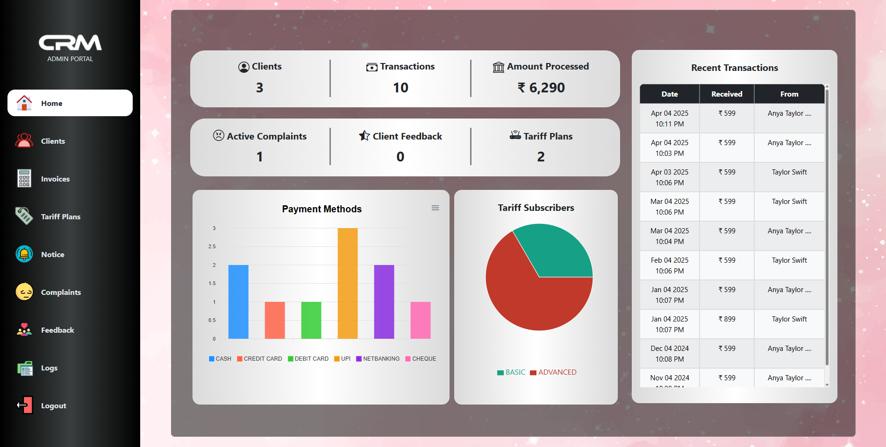

# Customer Relationship Management for Local ISPs

A **Customer Relationship Management (CRM) system** designed specifically for **local ISPs** to manage customers, track subscriptions, handle billing, and streamline support operations efficiently.

## 🚀 Features

- **Customer Management**: Add, edit, and delete customer details.
- **Subscription Tracking**: Monitor active/inactive subscriptions.
- **Billing & Invoicing**: Generate invoices and track payment history.
- **Support Ticketing System**: Manage customer issues and resolutions.
- **Admin Dashboard**: View insights and system performance.

## 🛠️ Tech Stack

- **Frontend**: React (JavaScript)
- **Backend**: FastAPI (Python)
- **Database**: PostgreSQL
- **Authentication**: Auth0

## 📦 Installation & Setup

### Prerequisites

Ensure you have the following installed:

- Node.js & npm (for React)
- Python3.12 & pip (for FastAPI)
- SQL database (PostgreSQL)

### Database Setup

# Create SQL Database
# all the database commands are available in SQL_Database/commands.sql

### Backend Setup

```sh
# Clone the repository
git clone https://github.com/av1-is-better/Customer_Relationship_Management_For_Local_ISPs.git
cd Customer_Relationship_Management_For_Local_ISPs/Backend

# Create a virtual environment & activate it
python -m venv venv
source venv/bin/activate  # On Windows use `venv\Scripts\activate`

# Install dependencies
pip install -r requirements.txt

# create .env with all necessary credentials (use sample.env)

# Run the FastAPI backend
uvicorn main:app --reload
```

### Frontend Setup

```sh
cd ../Frontend

# Install dependencies
npm install

# Enter all necessary credentials in main.jsx

# Start the React frontend
npm run dev
```

## 🔗 API Documentation

Once the FastAPI server is running, you can view the API documentation at:

- **Swagger UI**: `http://127.0.0.1:8000/docs`
- **Redoc**: `http://127.0.0.1:8000/redoc`

**Star ⭐ this repository if you find it useful!**

